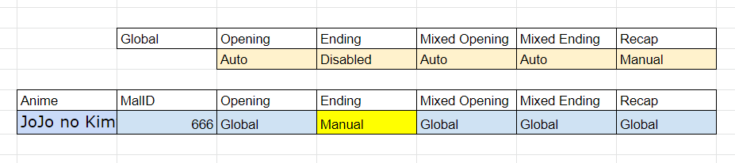

---

**Is your feature request related to a problem? Please describe.**  
**Setting**: So you're in a bar, and the bartender asks you what do you want.  
- You say you want to _eat something because you're hungry from pressing left click 50 times_.
- In my case, I am _tired of manually skipping stuff because the skipping rules are global_.

**Describe the solution you'd like**   
You say you want _skimmed milk dipped triple chocolate cookies from LIDL_.  
In my case, I want _Anime specific skipping rules_.  

**[Optional] Describe alternatives you've considered**  
You say you tried _rehydrating and sleeping to quench your thirst, but it proves ineffective_.
In my case, I say I tried _manually skipping, but it was not user-friendly, I'd rather watch [Nero vtubing](https://www.youtube.com/watch?v=JyxME9uC_Sc)_.

**[Optional] Additional context**  
If you could think of how (conceptually)
- Step 1
- Step 2
- Step 3
  ...

_Or_ you have a concept art

_Or_ you know an example or have the technical expertise  
- [link to somewhere](https://github.com/THIS-IS-NOT-A-BACKUP/.github/blob/main/profile/README.md)

**We always welcome contribution! Don't be shy, we're learning as well** 

