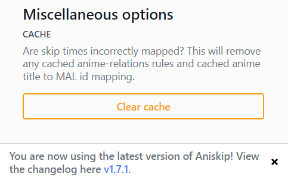
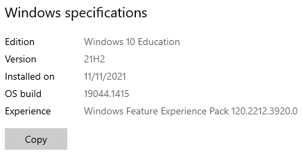
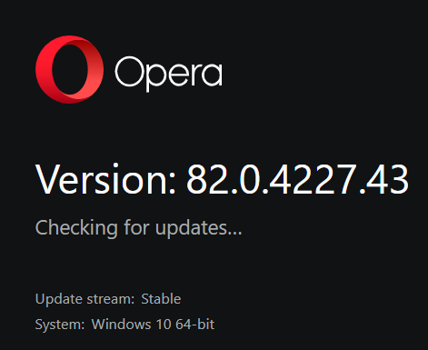

---

**Describe the bug**   
**Setting**: You're in a barbershop, and the barber asks you what's the deal?  
- You say _my hair is too long_, **even though** _it shouldn't be this long_.  
- I say _the automatic anime title detection failed, it always links me to Bunny Girl Senpai (love it tho)_, **even though** _it should be detecting my current anime_.  

**To Reproduce**  
Steps to reproduce the behavior:
1. Go to '...'
2. Click on '....'
3. Scroll down to '....'
4. See error

**Optional, but highly recommended  
1. Update extension
2. Try again
   
**IMPORTANT: If unsure**, say _I think..._, otherwise we would take ages trying to reproduce something that isn't there.  

**Screenshots**  
If applicable, add screenshots to help explain your problem.

**Device Information**  
1. Include extension version (bottom of the settings, just scroll down after clicking the extension icon)
   
2. Operating system, and version
   _Windows 10 Education, Build 19044.1415_
   
3. Browser type (_Chrome/Firefox/Brave/Netscape/etc_) and browser version (usually under `Help`->`About`, search for it!)  
  _Opera [Windows 10 64-bit], 82.0.4227.43_  
  

**Additional context**  
If you have an idea of where it possibly when wrong, do let us know!

**We always welcome contribution! Don't be shy, we're learning as well**  

